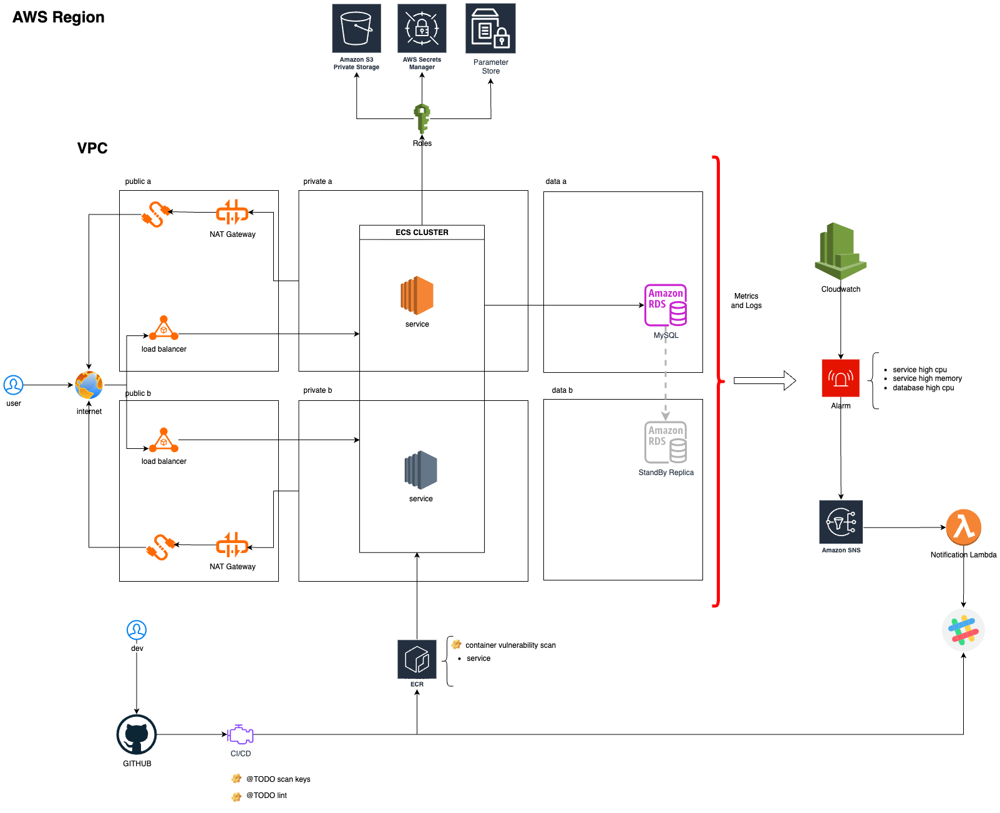

# Basic AWS Stack Demo with NodeJS API & Terraform

## Table of content

   * [Solution overview](#solution-overview)
   * [Infrastructure](#infrastructure)
   * [Prerequisites](#prerequisites)
   * [Usage](#usage)
   * [Sample backend service in NodeJS](#nodejs-api)
   * [License](#license)


## Solution overview

This repo contains Terraform code to deploy a NodeJS API that connects to a PostgreSQL database and can send files to an S3 bucket.

<p align="center">
  
</p>


## Infrastructure

The `aws/` folder contains the terraform code to deploy AWS resources, and `aws/mods/` is for the modules.

About the modules:

- networking: will create resources if `vpc_id` is empty.
  - vpc
  - public, private and data subnets
  - nat gateway, elastic ips and routes

- rds: postgresql database
  - security group
  - database subnet group
  - database parameter group
  - database instance
  - random password and secrets 
  - paramter store
  - cloudwatc alarms

- alb: will create application load balancer if `create_alb` is `true`
  - security group
  - application load balancer
  - http listener

- s3: bucket with versioning enabled
- sns: sns alarm topic 
- ecr: container image repository
- ecs/cluster: ecs cluster using fargate
- ecs/task-def: ecs task definition
  - execution role to deploy the service
  - task role
  - task definition

- ecs/service: ecs service
  - security group
  - target group with health check
  - listener rule to attach to a listener
  - ecs service attached to a load balancer
  - cloudwatch alarms

- devops: configure github actions
  - oidc github provider
  - github deployment role
  - envs on github actions


## Prerequisites

### AWS Credential
See `~/.aws/credentials`
```
  [EXAMPLE]
  aws_access_key_id = KEY
  aws_secret_access_key = SECRET
```
### Terraform
```bash
  terraform -v # Terraform v1.13.2
```

### Github Token

[Check here](https://docs.github.com/en/github/authenticating-to-github/creating-a-personal-access-token) to create one.
```bash
  github_token = "ghp_{random long string}""
```


## Usage

### Create a tfvars file

+ `aws_profile`: aws profile name (see ~/.aws/credentials)
+ `aws_region`: aws region
+ `prefix`: a prefix to use on every resource
+ `vpc_id`: vpc ID (leave empty to create everything)
+ `github_token`: github token
+ `repository_owner`: github owner
+ `repository_name`: github repo name


```bash
cd aws/
terraform init
terraform plan
terraform apply
```

or 

```shell
terraform plan -var aws_profile="your-profile" -var a=1 -var b=2 -var etc=...
terraform apply -var aws_profile="your-profile" -var a=1 -var b=2 -var etc=...
```


## NodeJS API

```bash
$ cd services/backend
$ docker compose up -d

$ docker ps
CONTAINER ID   IMAGE            COMMAND                CREATED     STATUS    PORTS                      NAMES
fa402c00c4ff   test/backend…    "docker-entrypoint.s…" 1 hour ago  Up 1 hour 0.0.0.0:8080->8080/tcp…    backend-backend-1
84f6caa1629c   postgis/postg…   "docker-entrypoint.s…" 1 hour ago  Up 1 hour 0.0.0.0:61480->5432/tcp…   backend-postgres-1

```
This will expose `http://127.0.0.1:8080/status`, `http://127.0.0.1:8080/status/database` and `http://127.0.0.1:8080/s3/create`.

Don't forget to set up your AWS credentials in the container to test S3.


## License
This library is licensed under the MIT-0 License.